<h1 align="center">
    Project - Ngo Van Hau
</h1>

<p align="center">
  <strong>Kanj _ Connect Everyone - Everywhere:</strong><br>
  Build mobile apps with React Native.
</p>

# Contents

-   [Introduction](#-introduction)
-   [All of feature](#-all-of-feature)
-   [Run app in dev environment](#-run-app-in-dev-environment)
-   [Run app your android device](#-run-app-your-android-device)
-   [UI](#-ui)

# Introduction

Kanj app is a charity social networking application running on mobile phones, for the purpose of sharing information and creating auctions for charity purposes.

# All of feature

-   Manage feed
-   Manage auction
-   Search post by hashtag, username, content
-   Search auction by username, category, price, title
-   Change theme color, language
-   Edit profile, change avatar
-   Login with account, login by GG, register
-   Like/dislike feed, auction
-   Pay auction with Momo
-   Notification when have new comment, accept auction, like feed, like auction
-   Feedback
-   Chat
-   Rating user

# 📖 Run app in dev environment

You have 2 way to start project in development

## Required install

-   Node 12 or newer.
-   Java SE Development Kit (at least the version 8) or OpenJDK from AdoptOpenJDK
-   Android studio (make sure the boxes next to all of the following items are checked: Android SDK, Android SDK Platform, Android Virtual Device)

Follow the detail [installation instructions][install_env] to install development environment of React Native.

[install_env]: https://reactnative.dev/docs/environment-setup

## Start app with connect device by USB

Required

-   Android 5.0 (Lollipop) or newer
-   Connected via USB
-   USB debugging enabled

Run this command

```
yarn android&&yarn start
```

## Start app with expo app in your phone

Required

-   Expo Go app installed

### Step

1. Run this command

```
expo start
```

2. Scan the QR code with Expo Go

## For production

1. Build apk

```
cd android && ./gradlew assembleRelease
```

2. Install apk

```
adb install -r android/app/build/outputs/apk/release/app-release.apk
```

3. Start server local

```
cd app&&python3 manage.py runserver localhost:5000
```

Server of this project releases in this [repo][repo-link-server].

[repo-link-server]: https://github.com/haungo2109/btl_caccongnghelaptrinhhiendai

# Run app your android device

Copy and install file **kanj-app.apk** in your android device

# UI

**Wellcome Screen**

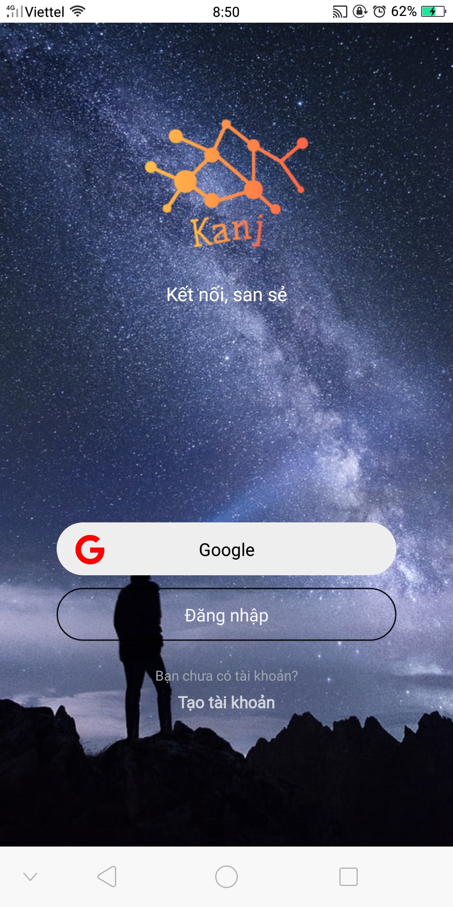

**Login Screen** (by account and by Google)

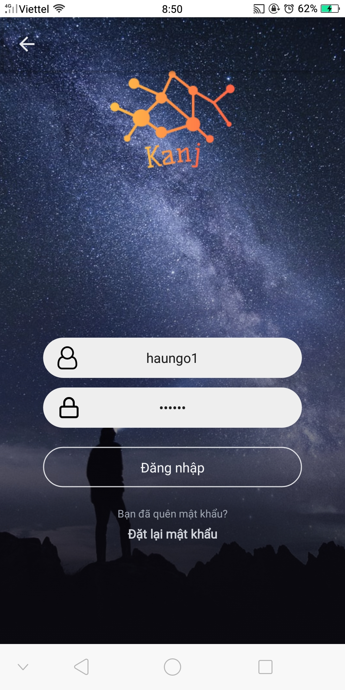
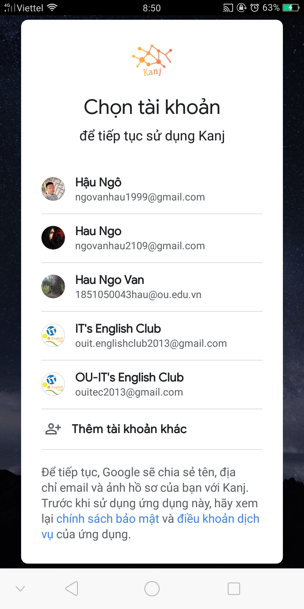

**Register Screen**

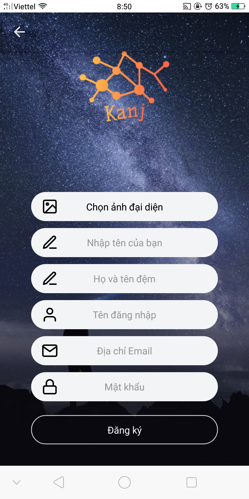

**Draw Screen**

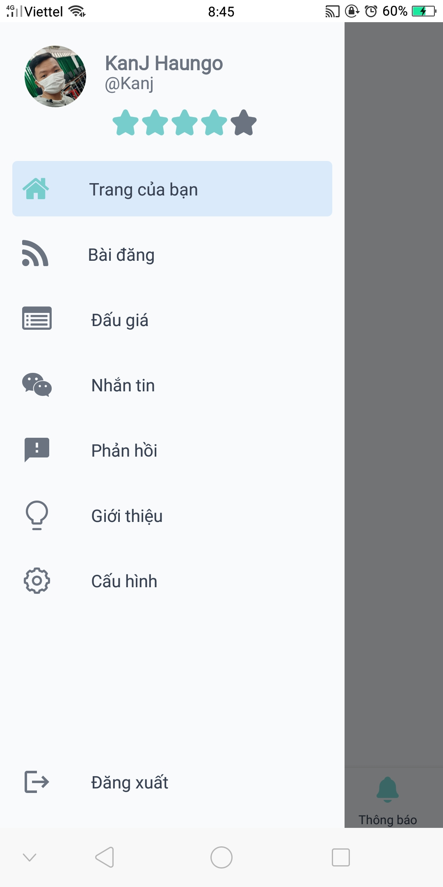

**Register Screen**


**Home Screen**

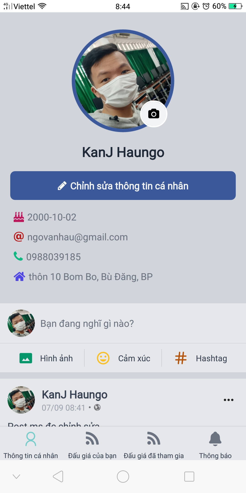

**Home-My Auction Screen**

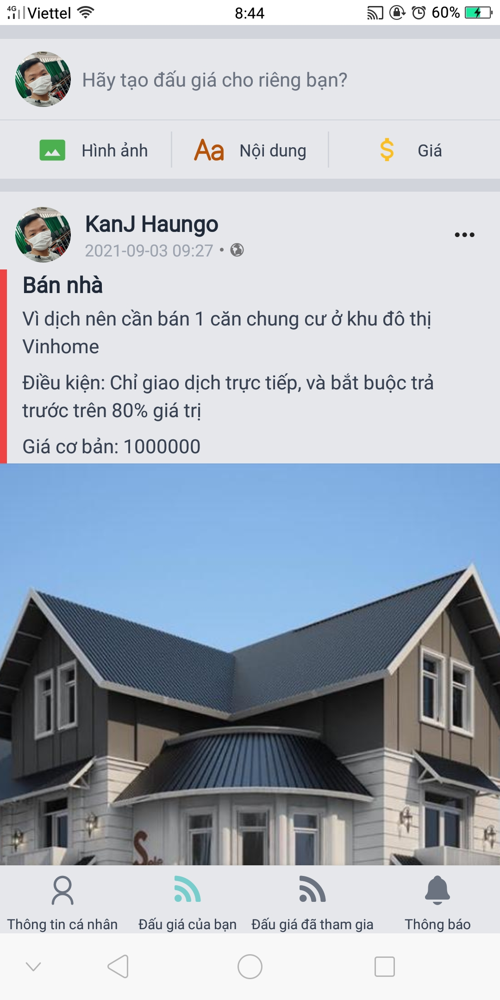

**Home-My Join Auction Screen**

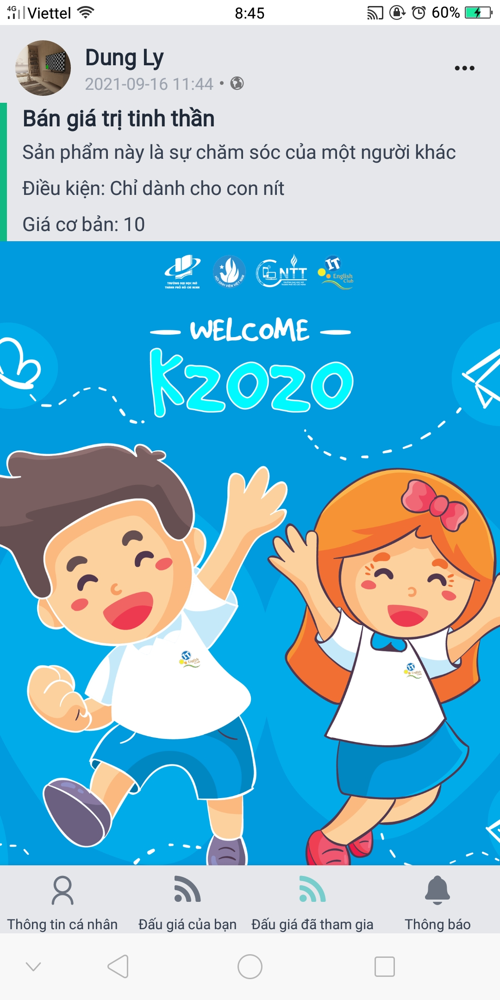

**Home-Notification Screen**

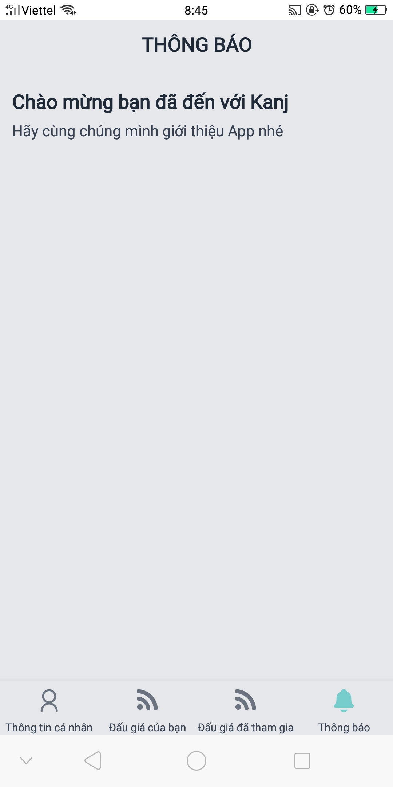

**Auction Screen**

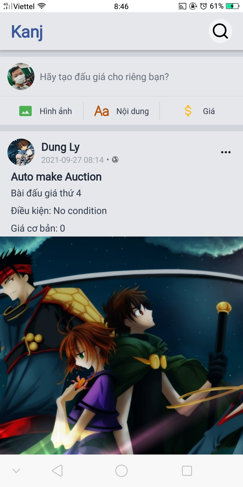

**Auction Create Screen**

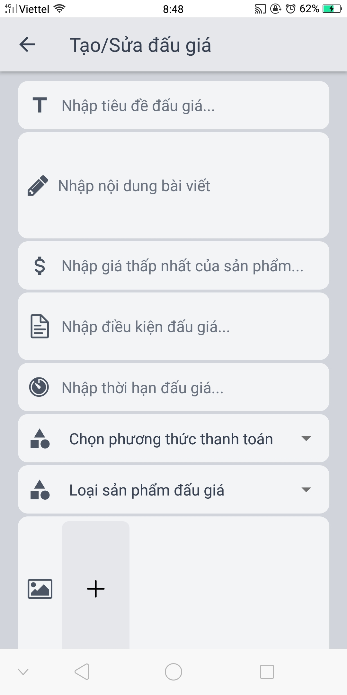

**Auction Detail Screen**

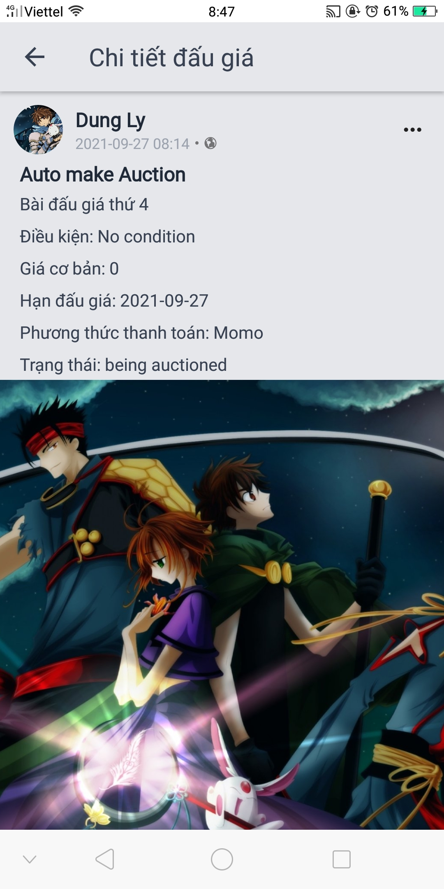

**Auction Pay Screen**

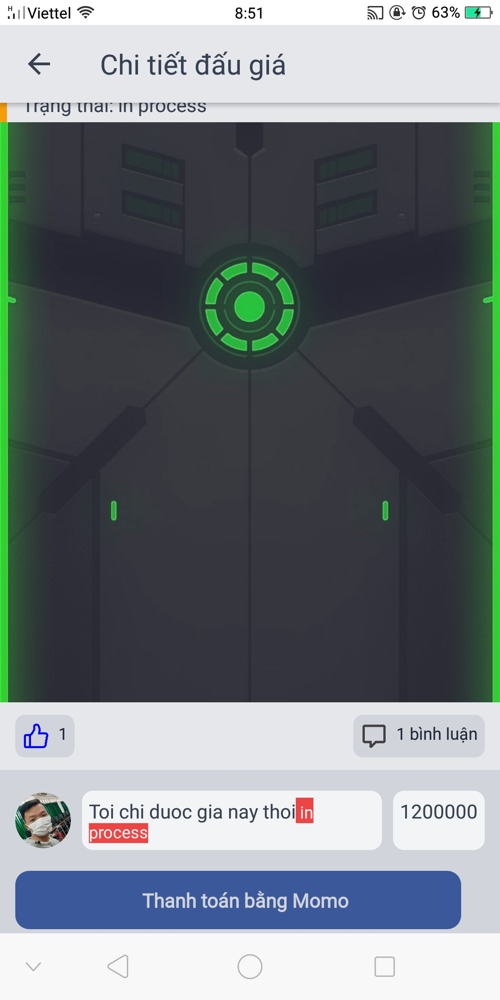

**Momo Confirm Screen**

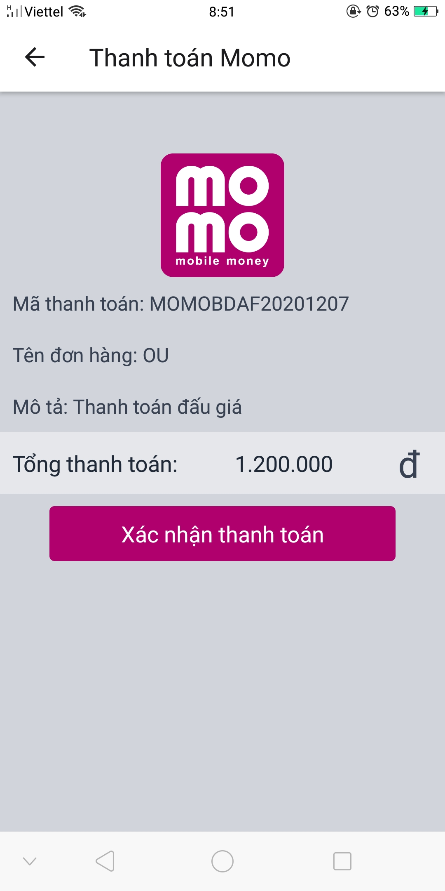

**Choose App Momo Screen**

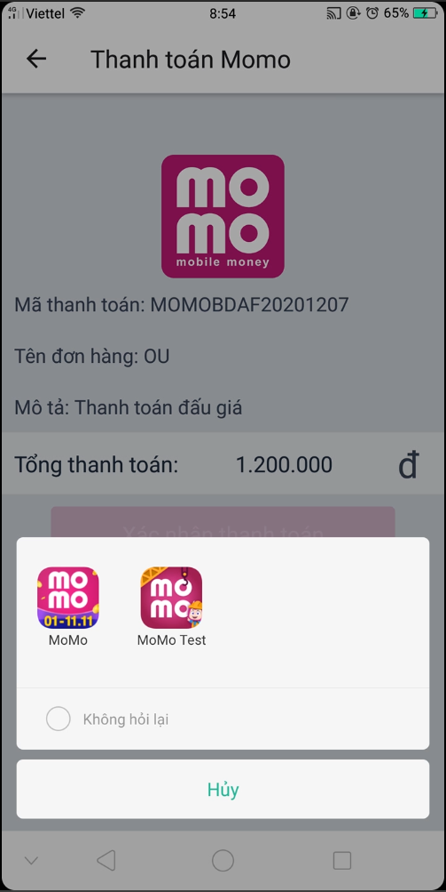

**Message Screen**

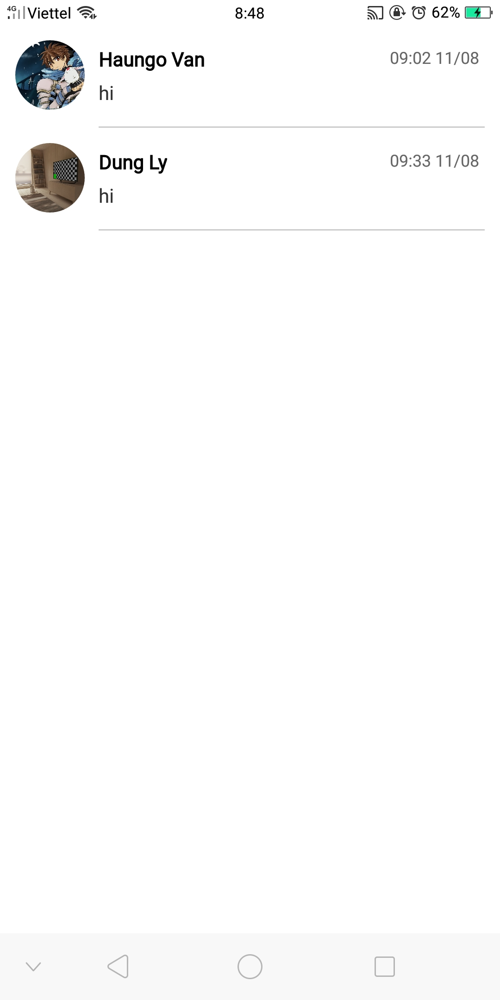

**Message Screen**

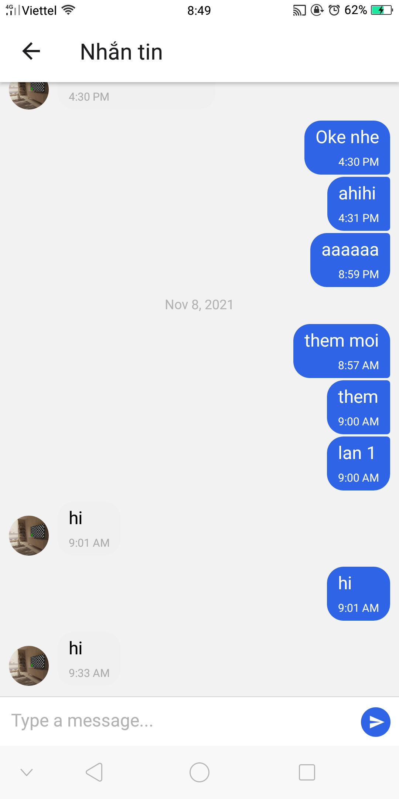

**Feed back Screen**

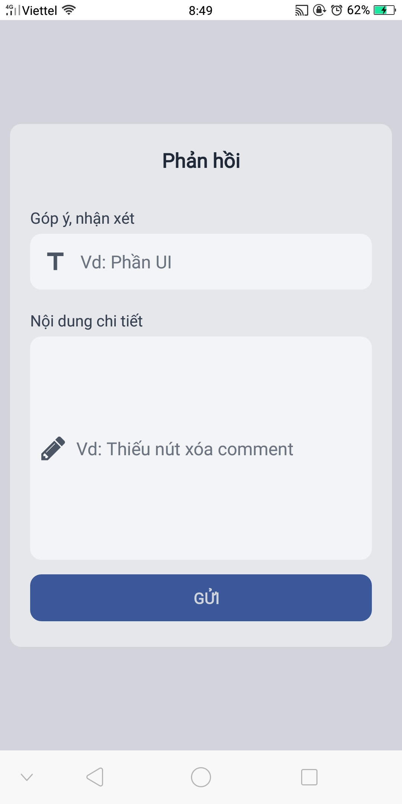

**Introduction Screen**

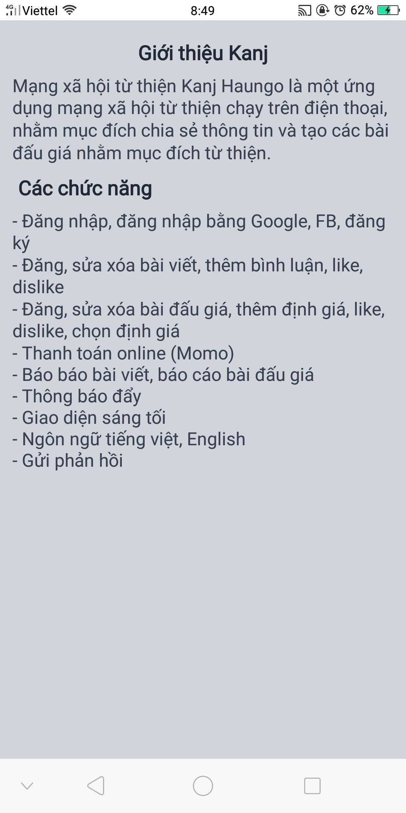

**Setting Screen**

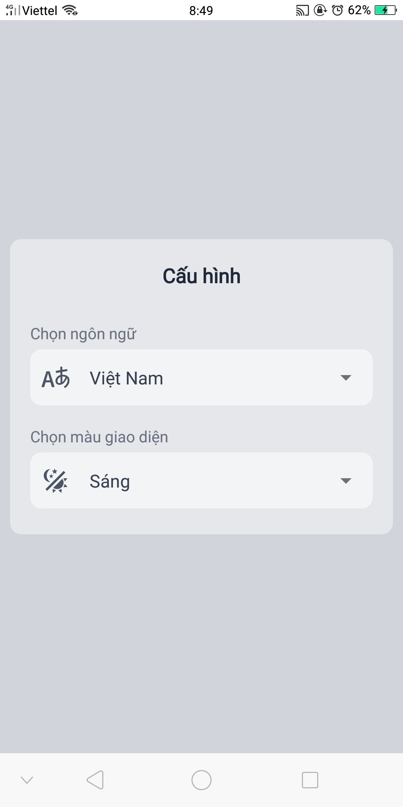

**Dark mode && English Language Screen**

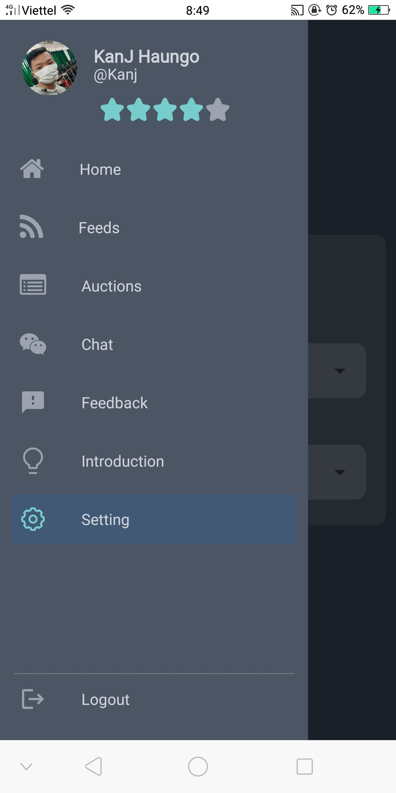
